* Table of contents. This line is required to start the list.
{:toc}

# Source to Prod Codelab

In this codelab, you will create a cohesive workflow which takes source code and builds, tests and promotes it to production. This will be accomplished via 3 pipelines:

* Bake & Deploy to Test
* Validate Test
* Promote to Prod

You will be using a custom-built image that includes sample application source code, a Jenkins instance, a Debian repository (aptly) and a Spinnaker instance.

This codelab is an extension of the [Hello World Deployment](http://spinnaker.io/documentation/hello-spinnaker.html) tutorial. It runs specifically on the Google Cloud Platform, and requires a billing-enabled GCP project.

## Part 0: Environment Setup

### Install gcloud

If you have `gcloud` installed, skip to the next section, “[Provision an instance of Spinnaker](#provision-an-instance-of-spinnaker-and-jenkins)”.

Install `gcloud` by running the following command and following through the prompts:

    curl https://sdk.cloud.google.com | bash

Authenticate `gcloud` to your account with your email address:

    gcloud auth login <your email address>

### Provision an instance of Spinnaker and Jenkins

We’ve created a single GCE image that includes Spinnaker, Jenkins, and aptly, along with embedded startup scripts that configure everything together for you. Create an instance of this image by running the following commands.

Fill in your project for `$MY_PROJECT`

    MY_PROJECT=<your project>
    INSTANCE_NAME=spinnaker-codelab-`date +%Y%m%d`
    ZONE=us-east1-b

    gcloud compute instances create $INSTANCE_NAME \
        --project $MY_PROJECT \
        --zone $ZONE \
        --image spinnaker-codelab \
        --image-project marketplace-spinnaker-release \
        --machine-type n1-highmem-8 \
        --scopes compute-rw,storage-rw \
        --metadata startup-script=/opt/spinnaker/install/first_google_boot.sh

Spinnaker will take a few minutes to auto configure and start up. Take 3 minutes to skim through Part 1 of this codelab below...

Open an SSH tunnel through which your local workstation will connect to Spinnaker:

    gcloud compute ssh $INSTANCE_NAME \
        --project $MY_PROJECT \
        --zone $ZONE \
        --ssh-flag="-L 8084:localhost:8084" \
        --ssh-flag="-L 8087:localhost:8087" \
        --ssh-flag="-L 9000:localhost:9000" \
        --ssh-flag="-L 9090:localhost:9090"

## Part 1: Bake & Deploy to Test

In this first exercise, you’ll set up a pipeline, named Bake & Deploy to Test, which builds a GCE image, deploys it as a server group to a test cluster, then destroys the previous server group in that cluster (classic blue/green strategy). The pipeline is triggered by a Jenkins continuous integration job.

The workflow is shown in the figure below.

### Create a Spinnaker Application

Navigate to Spinnaker at [http://localhost:9000]().

From the Spinnaker home page, create a new Spinnaker Application by clicking on the *Actions* drop down at the upper right and clicking on *Create Application*.

In the *New Application* dialog:

* Enter "codelab" for *Name*.
* Enter your email for *Owner Email*.
* Click in the *Accounts* field and choose “my-google-account”.
* Click the *Create* button.

### Create a Load Balancer

First we create a load balancer for your cluster. Navigate to the LOAD BALANCERS tab and click the *Create Load Balancer* button:

* Enter “test” for *Stack*.
* Click the *Next* button.

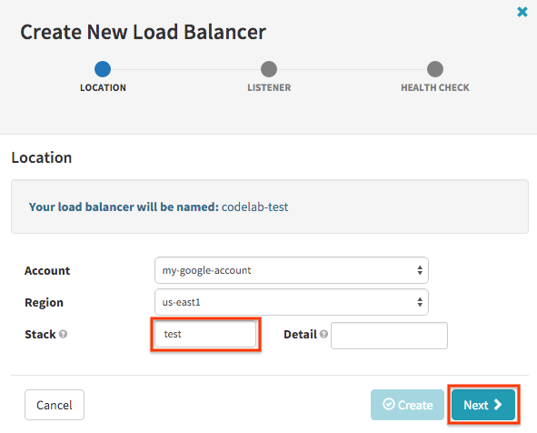

* In the Listener section, set the *Port Range* to be 7070, as that’s the port that our sample application listens on.
* Click *Next*.

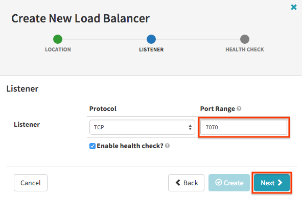

* In the HTTP Health Check section, enter “7070” for *Port* and “/hello” for *Path*.
* Optionally, enter 1 for all health check values so server groups report healthy much faster.
* Click the *Create* button.

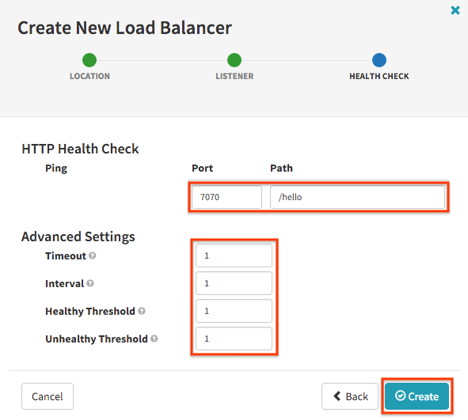

### Setup Pipeline: Bake & Deploy to Test Pipeline

The purpose of this pipeline is to generate a GCE image from a package, and then deploy the image on server groups in the test cluster. We want this pipeline to be kicked off every time the Jenkins continuous integration job completes.

Create a new pipeline by navigating to the PIPELINES tab and clicking *Configure*, then *Create New ...*

* Name the pipeline “Bake & Deploy to Test”.
* Click the *Create Pipeline* button.

#### Configure the pipeline

The first step in setting up a pipeline is to configure the pipeline. In particular, we need to specify an automated trigger that will kick off the pipeline.

We want this pipeline to kick off every time our Jenkins job completes. In the Automated Triggers section of the pipelines form:

* Click *Add Trigger*.
* Select “Jenkins” from the drop down menu for *Type*.
* Specify “jenkins” for the *Master* Jenkins instance.
* Specify “TestJob2” for *Job*.

Refer to the figure below for an illustration of what the pipeline’s Configuration form looks like when we’re done.

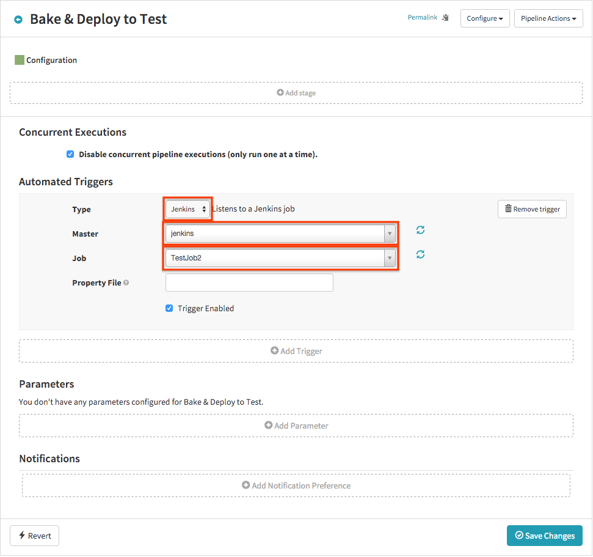

#### Setup Bake stage

The purpose of our “Bake” stage is to create a GCE image with package that was built by the Jenkins job that triggered this pipeline.

* Click *Add stage*.
* Select “Bake” in the *Type* drop down.
* Enter the Debian package you wish to include, “hello-karyon-rxnetty”, in the *Package* field.

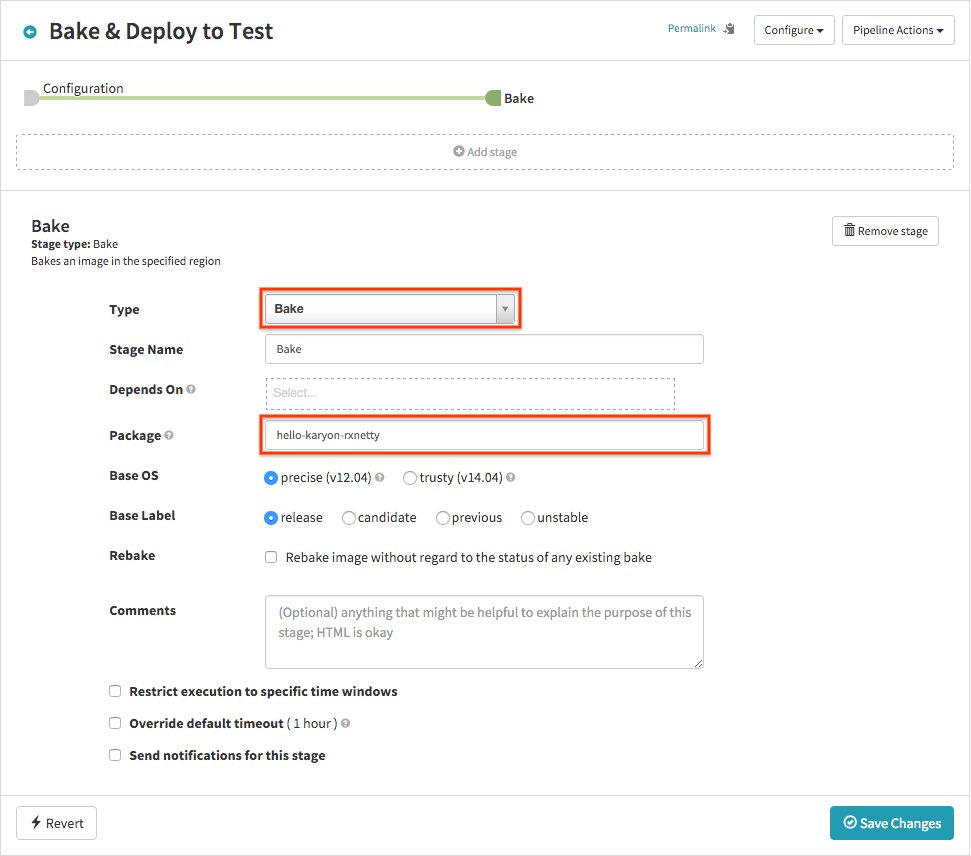

#### Setup Deploy stage

The purpose of the “Deploy” stage is to take the GCE image constructed in the “Bake” stage and deploy it into a test environment.

* Click *Add stage*.
* Select “Deploy” in the *Type* drop down.
* In the *Server group* section, click *Add server group*.
* In the dialog that appears, click *Continue without a template*.
* In the Basic Settings section, enter “test” in the *Stack* field and click *Next*.

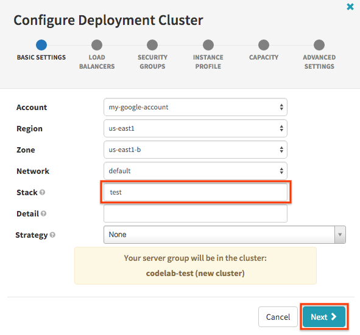

* In the Load Balancers section, add your load balancer ("codelab-test") and click *Next*.

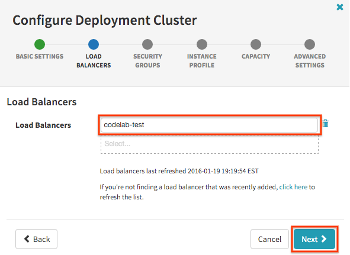

Security groups map to GCP firewall rules, along with the use of target tags to route traffic. There are default firewall rules in place which are sufficient for our use here.

* Click *Next* past the Security Groups section.
* In the Instance Profile section, choose “f1-micro” in the drop down and click *Next*.

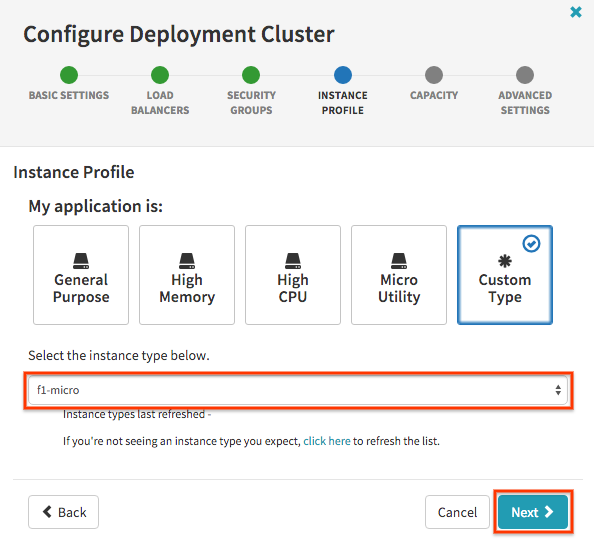

* In the Capacity section, leave 1 as the number of instances and click *Add*.

#### Destroy previous server group

In this tutorial use case, on successive deployments of new server groups to the test cluster, we don’t need the previous server group anymore.

* Click *Add Stage*.
* Select “Destroy Server Group” for *Type*.
* Check *us-east1-b*, the zone of the previous test server group that you want to destroy.
* Type in codelab-test into the Cluster field.
* Select “Previous Server Group” for *Target*.
* Click *Save Changes*.

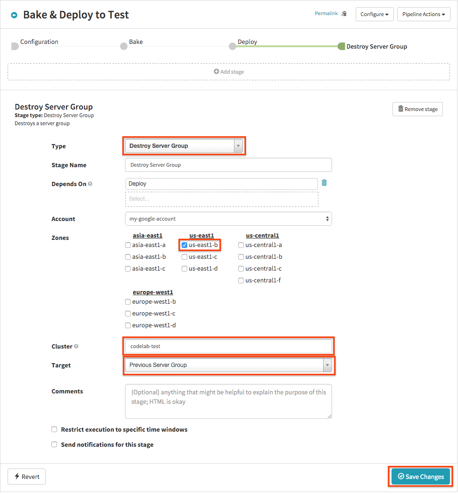

The pipeline is now complete. Take a moment to review the stages of this pipeline that you just built.

### Trying it out

Now let’s run this pipeline. We trigger it by manually running a Build of the Jenkins job.

* Navigate to your Jenkins console at [http://localhost:9090/]().
  * Username: admin
  * Password: admin
* Click on the "TestJob2" job.
* Click *Build Now*.

It may take a while for the polling to trigger the job, but soon in the PIPELINES tab you can see progress, status and details.

The first time this pipeline is run, the Destroy Server Group stage will fail, because the selector for “Previous Server Group” will find nothing (no server groups presently in the test cluster). The Deploy stage, however, does succeed, so a test cluster will be created.

Try running it again, either by running another Build of the Jenkins job, or by manually triggering from the PIPELINES tab (click *Start Manual Execution*). It will succeed all the way, and your pipeline execution details will look like below:

You can now see in the CLUSTERS tab that a new server group has been deployed to the test cluster, and the previous server group is destroyed (i.e. does not exist).

You can also introspect server group details by clicking on a server group. In the details panel on the right, you can see under the PACKAGE section details about how we built this server group. Information like package name, build number, down to commit hash and link to the Jenkins job.

## Part 2: Validate Test

The second pipeline, named “Validate Test”, is a simple one-stage placeholder to represent some gating function before pushing to prod.

Furthermore, we configure the prod deployment to implement the red/black strategy (a.k.a. blue/green), which means that upon verifying health of the new server group it will immediately disable the previous server group in the same cluster. Here we disable rather than destroy, so that rollbacks can be quickly accomplished simply by re-enabling the old server group.

### Setup Pipeline: Validate Test

Create a new pipeline by navigating to the PIPELINES tab and clicking *Configure*, then *Create New ...*

* Name the pipeline “Validate Test”.
* Click the *Create Pipeline* button.

#### Configure the pipeline

We want this pipeline to kick off when the Bake & Deploy to Test pipeline completes.

* Click *Add Trigger*.
* Select “Pipeline” from the drop down menu for *Type*.
* Select your application.
* Select the “Bake & Deploy to Test” pipeline.
* Check “successful”.

#### Setup Manual Judgment stage

We stop and wait for human confirmation to continue:

* Click *Add stage*.
* Select “Manual Judgment” in the *Type* drop down.
* Specify *Instructions*, for example “Validate the test cluster”.
* Click *Save Changes*.

## Part 3: Promote to Prod

The third pipeline, “Promote to Prod”, takes the image that was deployed in the test cluster, and deploys that image to the prod environment, thereby promoting it.

### Create a Load Balancer

We create a load balancer for the prod cluster. Navigate to the LOAD BALANCERS tab and click the *Create Load Balancer* button:

* Enter “prod” for *Stack*.
* Click the *Next* button.

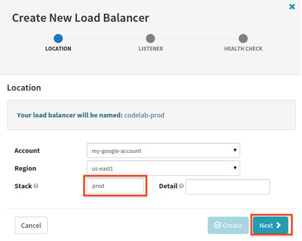

* In the Listener section, set the *Port Range* to 7070.
* Click *Next*.

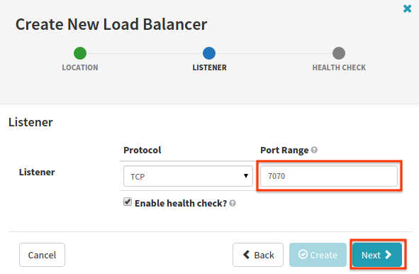

* In the HTTP Health Check section, enter “7070” for *Port* and “/hello” for *Path*.
* Optionally, enter 1 for all health check values.
* Click the *Create* button.

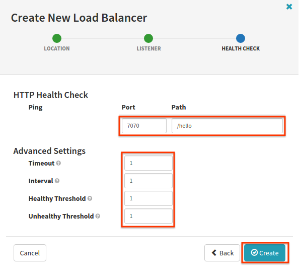

### Setup Pipeline: Promote to Prod Pipeline

Create a new pipeline by navigating to the PIPELINES tab and clicking *Configure*, then *Create New ...*

* Name the pipeline “Promote to Prod”.
* Click the *Create Pipeline* button.

#### Configure the pipeline

We want this pipeline to kick off when the Validate Test pipeline completes.

* Click *Add Trigger*.
* Select “Pipeline” from the drop down menu for *Type*.
* Select your application.
* Select the “Validate Test” pipeline.
* Check “successful”.

#### Setup Find Image stage

In the “Find Image” stage, we select the image that was deployed in the test cluster.

Click the *Add stage* button:

* Select “Find Image” for the stage *Type*.
* Enter codelab-test for the *Cluster*.
* Choose “Newest” for the *Server Group Selection*.
* Check the zone of the test server group to pick image from.

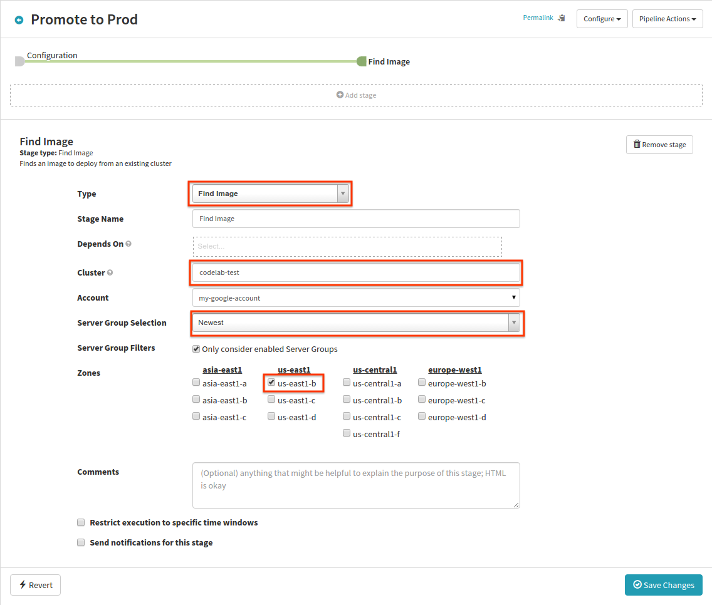

#### Setup the Deploy stage

We deploy the image that was picked, to the prod cluster.

* Click *Add stage*.
* Select “Deploy” in the *Type* drop down.
* In the *Server group* section, click *Add server group*.
* In the dialog that appears, click *Continue without a template*.
* In the Basic Settings section, enter “prod” in the *Stack* field.
* For Strategy, select “Red/Black”.
* and click *Next*.

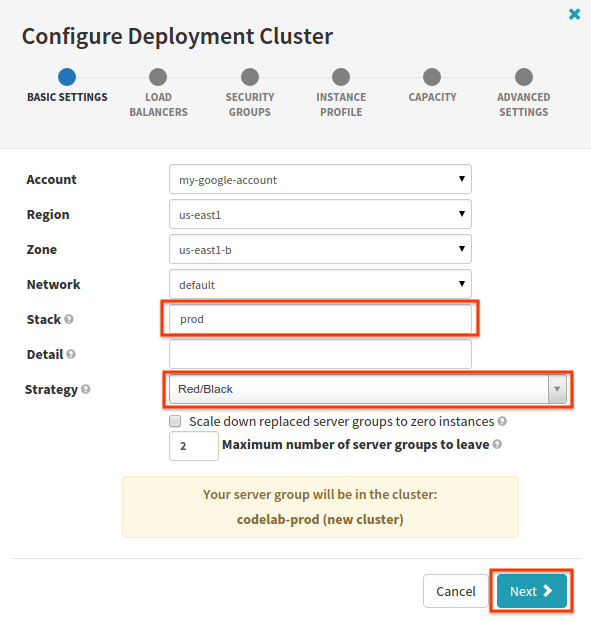

* In the Load Balancers section, add your load balancer ("codelab-prod") and click *Next*.

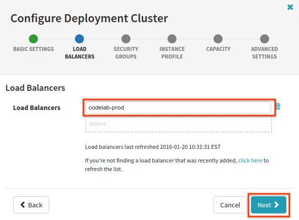

* Click *Next* past the Security Groups section.
* In the Instance Profile section, choose “f1-micro” in the drop down and click *Next*.

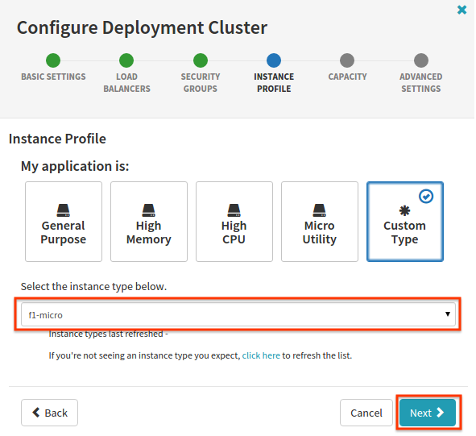

* In the Capacity section, leave 1 as the number of instances and click *Add*.
* Click *Save Changes*.

### Trying it out

Now let’s run through it all. Run a Build in Jenkins.

When the Bake & Deploy to Test pipeline completes, the Validate Test pipeline will trigger and wait for user input.

Click *Continue*. This will trigger the Promote to Prod pipeline:

In the CLUSTERS tab, you can see that a server group has been deployed to the prod cluster.

Because we selected the red/black deployment strategy for the deployment, there should always be only one enabled/active server group resident in the prod cluster cluster, with previous ones disabled (grey), even after successive runs of this pipeline. Try it out by manually invoking the promotion pipeline again.

## Extra Stuff

### Roll back

Sometimes things go wrong and you need to roll prod back to the previous release. We employed the red/black strategy, which disables the previous server group. In practice, this is disassociating the server group with the load balancer so it takes no traffic, while keeping the nodes in the server group up, standing by.

To roll back back to the previous server group, first kick off another instance of the Promote to Prod pipeline so that you have a previous disabled server group in the PROD cluster to roll back to. When this pipeline completes, navigate to the CLUSTERS tab and click the active server group.

* In the *Server Group Actions* drop down on the right, click *Rollback*.
* In the dialog that appears, select the server group you would like restore (roll back to).
* Type the name of the account to confirm your action.
* Click *Submit*.

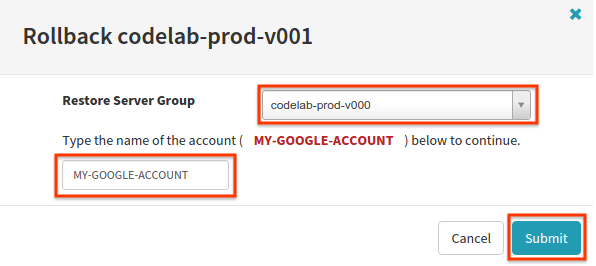

When the task completes (you can check progress in the TASKS tab), you will see that the specified server group is now the active one, while the previous one is disabled (grey).

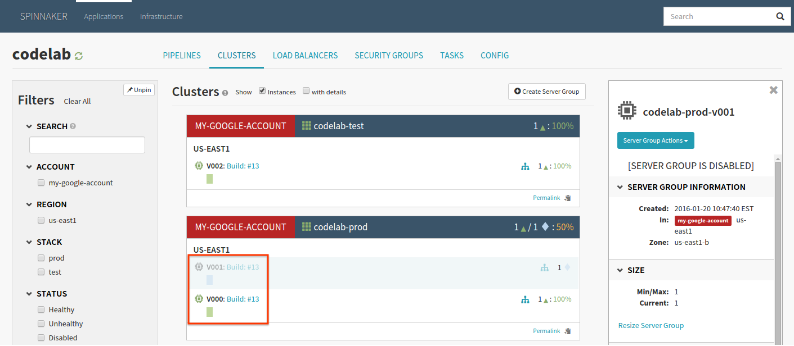

### Triggering the Jenkins job by changing source

So far you’ve been triggering the Jenkins job manually over unchanging source code. Consequently, you’ll notice that all server groups point back to the same Jenkins job. This is because Spinnaker can detect whether a re-bake is necessary, and because there were no changes, it simply returned the same image.

The image you’re using does have Jenkins polling for updates to the local git repo. If you trigger the Jenkins job as a result of code change, the image that’s built will be different, and you’ll see the build info change throughout the entire pipeline chain.

You can update source by doing the following from your ssh window:

    sudo su jenkins
    cd /home/jenkins/hello-karyon-rxnetty
    vi build.gradle
    # Change the number on the “release” line.
    git commit -a -m "Bump release number"

You’ll see the whole sequence again, but with a key difference: a new image will be baked, and the server groups deployed as a result will show different build info.

